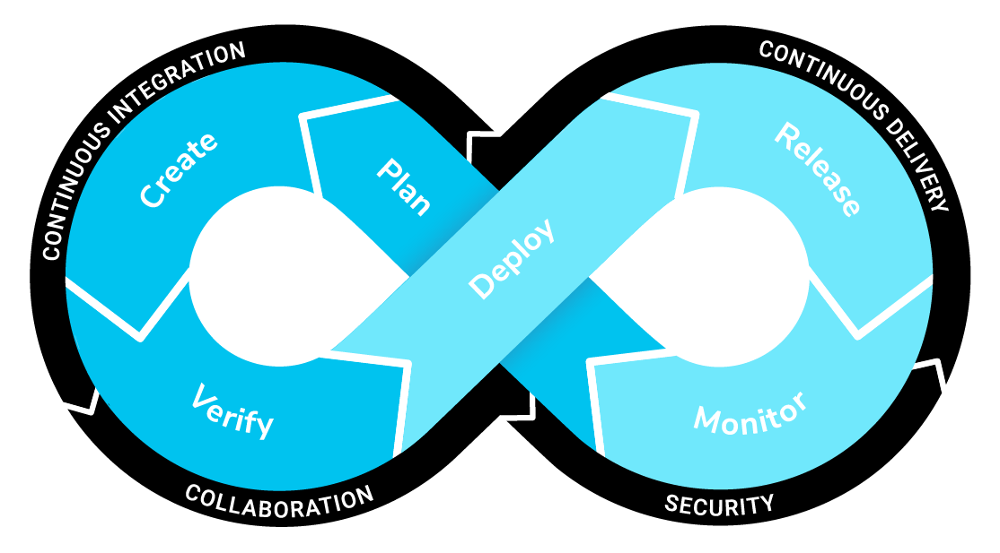

# Continuous Integration - Continuous Delivery

`Continuous integration` is a software development practice where members of a team use a version control system and frequently integrate their work to the same location, such as a main branch. Each change is built and verified to detect integration errors as quickly as possible. Continuous integration is focused on automatically building and testing code, as compared to continuous delivery, which automates the entire software release process up to production.

`Continuous delivery` is a software development methodology where the release process is automated. Every software change is automatically built, tested, and packaged or deployed. Before the final push to package or deploy, the team decides when the final push should occur. Although every successful software change can be immediately released to production with continuous delivery, not all changes need to be released right away.

These article details some great benefits from using CI/CD.

- https://developer.salesforce.com/blogs/2022/01/set-up-continuous-integration-for-your-salesforce-projects
- https://www.atlassian.com/continuous-delivery/principles/continuous-integration-vs-delivery-vs-deployment

## Git Commit Triggers

We'll fire our CI/CD processes based on Git commits to specific branches and the process will be different depending on the branch receiving the commit.

### Commit to feature branch

We will have a CI process to build a scratch org with a duration of 1 day upon every commit to a `feature` branch. This CI process will:

- run a lint utility on LWC and Aura Javascript

- run the [Salesforce Code Analyzer](https://forcedotcom.github.io/sfdx-scanner/en/v3.x/scanner-commands/run/) on the codebase

- deploy metadata to the scratch org to verify it deploys correctly

- run unit tests to check that they pass

- check that each apex class and trigger has > 85% coverage

This is a great check for developers that everything is ready for a Pull Request. It also lets the Pull Request approver know that the feature changes is ready for review.

### Merge feature branch to dev branch

We will have a CI process to build a scratch org with a duration of 10 days upon every commit to the `dev` branch. This build validates the same things the the feature branch build does but also:

- creates a username and password we can use to login to this org to test the new feature

- assign our permission set to the scratch org user

- run any other Apex scripts necessary to get the org ready for UAT

- load any test data needed for UAT

### Merge dev branch or hotfix branch to main branch

The CI process should build a package OR deploy code to the production Salesforce from the main branch. If building a package, this process may include:

- build a scratch org and install the package to test that a new install is successful.

- upgrade the package in a permanent org to make sure it is successful.

## Setup JWT Bearer Flow Authorization for Salesforce CI-CD

Continuous integration (CI) environments are fully automated and don't support the human interactivity of the OAuth 2.0 web server authorization flow. In these environments, we must use the JSON web tokens (JWT) bearer flow to authorize an org. With this flow, explicit user interaction isn’t required.

The JWT bearer authorization flow requires a digital certificate, also called a digital signature, to sign the JWT request. We will create a self-signed certificate using OpenSSL.

Follow all the instructions documented in [Salesforce DX Developer Guide](https://developer.salesforce.com/docs/atlas.en-us.sfdx_dev.meta/sfdx_dev/sfdx_dev_auth_jwt_flow.htm#sfdx_dev_auth_jwt_flow).
