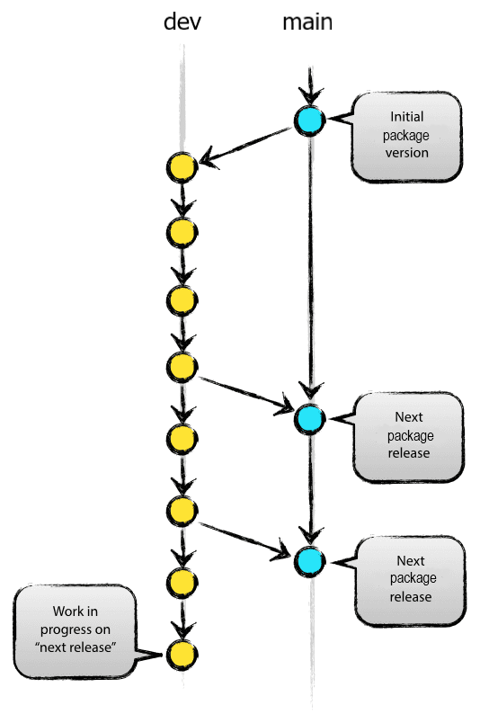
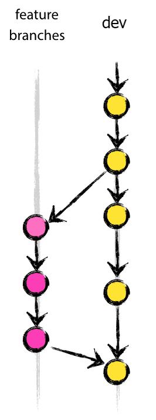
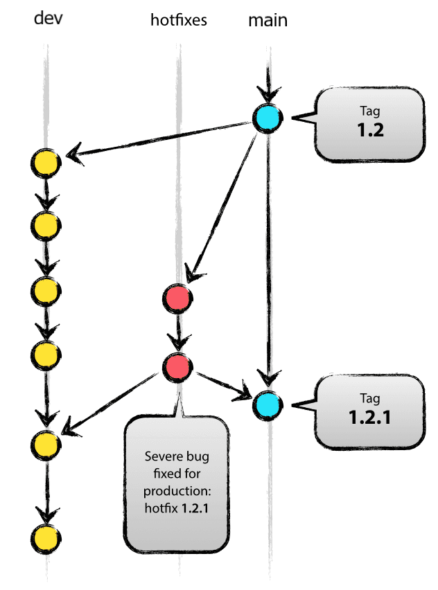
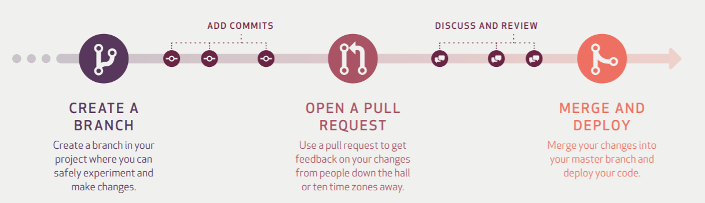

# Git Branching Model
This document describes the recommended Git flow we'll use while developing application features in Salesforce. Our process closely follows this [classic Git branching model](https://nvie.com/posts/a-successful-git-branching-model/#the-main-branches) and includes an automated [Continuous Integration and Continuous Delivery](Salesforce-CICD-Process.md).

This model supports:
- multiple developers working on different features at a time in their own scratch org which is a best practice
- QA testing shifted left (early in the lifecycle) for new features
- unfinished or untested features moving into a future sprint without delaying a release date
- a new sprint beginning without being delayed by qa testing
- an easy path to generating a hotfix changes for urgent bugs without disrupting a sprint

## Our Branching Model
Our model will contain most of the branches in the article referenced above except for `release`. Our naming convention will use `main` instead of `master` and `dev` instead of `develop`. Here are the branches we'll have and how they will be used:
- `main` - The branch we'll use to release to production (or build a new package version) at the end of each sprint. We'll tag the release name or package version for each commit that is deployed to production or builds a package. We can create release notes of which features made it into the release.
- `hotfix/what_we_will_fix` - We'll create a hotfix branch if we need to fix an urgent bug for a customer. We will branch off `main` and will only commit the minimal code needed to fix the bug. Once the change has been tested, we'll merge this branch directly into the `main` branch to build a new release or package version and `dev` branch to keep it up to date. These hotfix branches should be deleted once they've been tested and merged.
- `dev` - This will be a permanent branch that we use for sprint development. The `main` branch will be fetched into this branch at the start of every sprint. Developers will create feature branches off the `dev` branch, complete their code and create a Pull Request that will merge the feature back into the `dev` branch once reviewed and approved. At the end of a sprint, the `dev` branch will be merged into the `main` branch.
- `feature/my_name/issue-123` - Developers will create these feature branches off the `dev` branch and ideally complete just one story in this branch. It is OK to complete 2 or 3 stories in a feature branch as long as the changes for the stories or bugs are small and simple. If we're using an issue tracking system that integrates with our repository, we should include add the name of the story or bug in the feature name so the branch will be related to it. Once a feature is complete, a Pull Request is created so the changes can be reviewed and approved. Feature branches will be deleted once their PR is approved and they've been merged into the `dev` branch.

### Diagram of dev and main branches

### Diagram of feature and dev branches

### Diagram of main and hotfix and dev branches

## Git Development Flow
1. Developers should never jointly develop in the same org. Developers will create and maintain their own scratch org. These expire after 30 days so they are responsible for creating new scratch orgs as needed. It makes sense to have 3 week sprints and have developers create a new scratch org at the start of every sprint to avoid a scratch org with uncommitted changes from expiring. The steps for creating a scratch org should be documented and should only take 5 - 10 minutes to complete.
2. Developers will fetch/pull the latest from the `dev` branch before starting on a new feature.
3. Developers will create a new branch from the `dev` branch and name it `feature/my_name/issue-123` so we can easily identify what kind of branch it is, who is working on it and it's corresponding story or bug name.
4. Developers will make their changes for the story and commit all code changes to their `feature` branch along with a commit comment. Our CI/CD process runs a validation on each `feature` branch commit to lint and analyze code for security issues, make sure the metadata deploys, that all unit tests pass and that code coverage is sufficient. This validation builds a scratch org that is deleted once the validation is complete.
5. Once the developer has tested their feature and provided instructions on how to test in the story, they should create a Pull Request to merge their `feature` branch into the `dev` branch and request a review.
6. A senior developer will be responsible for reviewing Pull Requests. Things to review include everything documented in our [Salesforce Development Standards](Salesforce-Development-Standards.md) such as:
    - Naming Conventions
    - Proper language and correct spelling of object and field names and descriptions along with any other text visible to users
    - Good code that's easy to understand and/or is well commented
    - Unit test exists for new code and that has > 80% coverage
    - The package.xml was updated with added metadata
    - Nothing that has already been packaged was deleted (if building a managed package)
    - Code will pass an internal or Salesforce Security Review
7. The reviewer will have the developer make any changes needed. Once the reviewer is happy with the PR, they will approve it which will merge it into the `dev` branch.
8. We have a CI/CD process that will build and configure a new scratch org that lasts for 10 - 20 days based off code in the `dev` branch. This will allow the test team or business users to login to the scratch org and test the feature. If the feature fails testing, the developer will create another feature branch to fix the issue before deploying any other new features.

### Diagram of Git Pull Request
In the example below, the create a branch step is a `feature` branch and the merge and deploy goes into our `dev` branch.

## Git Package Build Flow
1. At the end of the sprint, we'll check that all features that were merged into the `dev` branch have passed QA testing. Any feature that failed testing can be removed, commented out or fixed depending on the urgency of the feature and when the release needs to go live in production.
2. Once the test team signs off on features in the `dev` branch, it will be merged into the `main` branch.
3. SFDX scripts will be used to build a new "released" application or package version from the `main` branch. We will create a Release record in GitHub by tagging the released `main` branch so we can document links to completed stories and bug fixes.
4. The test team will verify that the new package installs correctly for new installs and for upgrades (if building a managed package). This step can be automated with SFDX scripts.
5. The `main` branch will be merged into the `dev` branch so it has the latest and greatest for the new sprint.
